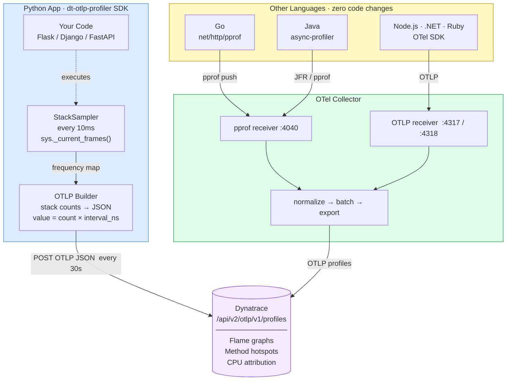
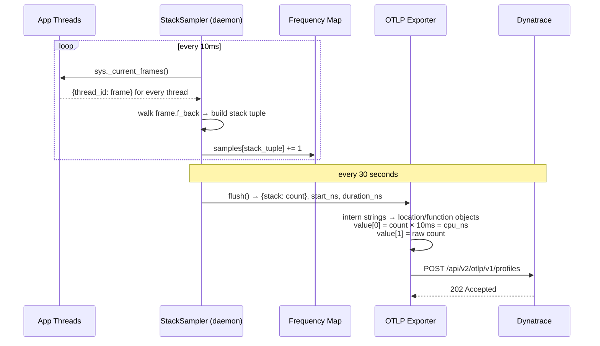
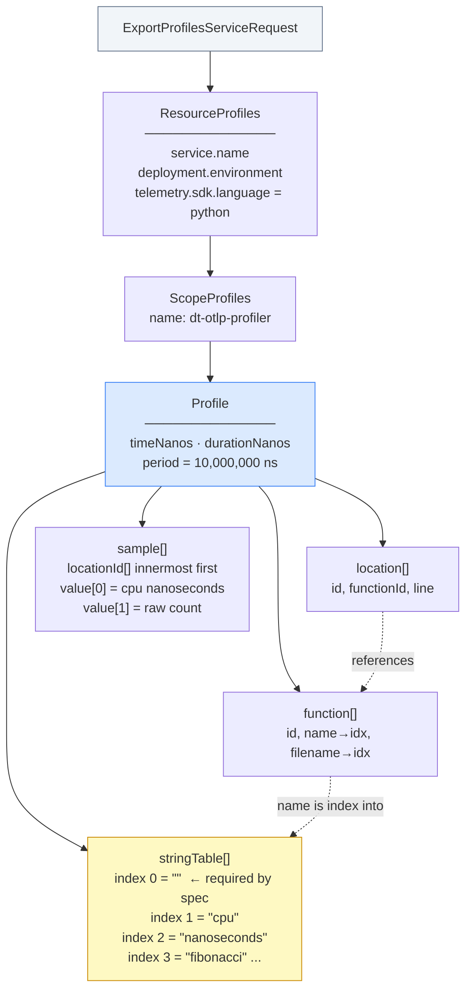

# Dynatrace OTLP Continuous Profiling

> Demonstrates continuous code profiling ingested into Dynatrace via **OTLP Logs**,
> with optional trace correlation — link method hotspots directly to distributed traces.

---

## What this shows

| Capability | How it's demonstrated |
|---|---|
| Continuous profiling via OTLP Logs | App emits profiling data as structured OTLP log records to `/api/v2/otlp/v1/logs` |
| Method hotspots | Stack frequency map → `profile.leaf_function` / `profile.cpu_ns` attributes |
| Trace correlation | `traceId` + `spanId` set on each log record — links profiles to Distributed Traces |
| Language-agnostic pipeline | OTel Collector accepts pprof from Go, Java, Python, Node.js, .NET |
| Full stack traces | Complete call chains captured, not just leaf functions |
| Zero instrumentation | Wall-clock sampling — no code changes to the profiled app |
| C# / ASP.NET Core SDK | Native .NET 8 SDK — cooperative sampler, same OTLP output, `UseDtProfiling()` middleware |

---

## Architecture



---

## Quick start

### Prerequisites

| Tool | Install | Required for |
|---|---|---|
| Docker 24+ | [docker.com/get-started](https://www.docker.com/get-started/) | All paths |
| Docker Compose v2 | Included with Docker Desktop | All paths |
| Dynatrace API token | Settings → Access tokens | Production mode |

**Required API token scopes:**
- `logs.ingest` — profiling data is sent as OTLP Logs
- `openTelemetryTrace.ingest` — if you also ingest traces from the same token

---

### Option 1 — Dev mode (no Dynatrace tenant needed)

Profiles decode to stdout. Use this to verify the stack before pointing at a real tenant.

```bash
git clone https://github.com/srijithsunil/dynatrace-otlp-profiling-poc
cd dynatrace-otlp-profiling-poc

cp .env.example .env
# .env already set to dev mode:
#   DT_ENDPOINT=http://validator:8888
#   DT_API_TOKEN=dev

docker compose up --build
```

After ~30 seconds you'll see this in the logs:

```
──────────────────────────────────────────────────────────────────────
  SERVICE   : profiling-demo-app
  WINDOW    : 2026-06-08T17:00:00+00:00
  DURATION  : 30.0s  PERIOD: 10.0ms
  SAMPLES   : 2847

  FUNCTION                       FILE                  CPU   BAR
  ------------------------------ -------------------- ------   ----------------------------------------
  fibonacci                      app.py               8420ms   ████████████████████████████████████████
  repeated_sort                  app.py               3120ms   ██████████████▊
  matrix_multiply                app.py               2860ms   █████████████▌
  sieve_of_eratosthenes          app.py               1540ms   ███████▎
──────────────────────────────────────────────────────────────────────
```

---

### Option 2 — Production mode (real Dynatrace tenant)

```bash
git clone https://github.com/srijithsunil/dynatrace-otlp-profiling-poc
cd dynatrace-otlp-profiling-poc

cp .env.example .env
```

Edit `.env`:

```dotenv
DT_ENDPOINT=https://your-env-id.live.dynatrace.com
DT_API_TOKEN=dt0c01.XXXXXXXXXX
```

```bash
docker compose up --build
```

Verify connectivity before starting:

```bash
source .env
curl -s -o /dev/null -w "%{http_code}" \
  -X POST \
  -H "Authorization: Api-Token $DT_API_TOKEN" \
  -H "Content-Type: application/json" \
  -d '{"resourceProfiles":[]}' \
  "$DT_ENDPOINT/api/v2/otlp/v1/profiles"
# Expected: 200 or 204
```

---

## Add profiling to your own Python app

### Install the SDK

```bash
# From this repo
pip install ./sdk/python

# Coming soon: pip install dt-otlp-profiler
```

### Integrate (2 lines)

```python
from dt_profiler import start_profiler
start_profiler()   # reads DT_ENDPOINT / DT_API_TOKEN from env
```

Call `start_profiler()` once at startup, before your web server initialises.

### Environment variables

```bash
export DT_ENDPOINT=https://your-env-id.live.dynatrace.com
export DT_API_TOKEN=dt0c01.XXXXXXXXXX
export OTEL_SERVICE_NAME=my-service
export DEPLOYMENT_ENV=production
```

### Framework integrations

**Flask**
```python
from dt_profiler import start_profiler
from flask import Flask

start_profiler()
app = Flask(__name__)
```

**Django — `wsgi.py`**
```python
import os
from django.core.wsgi import get_wsgi_application
from dt_profiler import start_profiler

os.environ.setdefault("DJANGO_SETTINGS_MODULE", "myproject.settings")
start_profiler()
application = get_wsgi_application()
```

**Gunicorn post-fork (multi-worker)**
```python
# gunicorn.conf.py
def post_fork(server, worker):
    from dt_profiler import start_profiler
    start_profiler()
```

**FastAPI**
```python
from contextlib import asynccontextmanager
from dt_profiler import start_profiler, stop_profiler
from fastapi import FastAPI

@asynccontextmanager
async def lifespan(app):
    start_profiler()
    yield
    stop_profiler()

app = FastAPI(lifespan=lifespan)
```

**Docker**
```dockerfile
FROM python:3.12-slim
COPY sdk/python /sdk/python
RUN pip install /sdk/python
# ... rest of your Dockerfile
```

---

## Add profiling to your own C# app

### Reference the SDK

```bash
# Via NuGet (recommended)
dotnet add package DynatraceOtlpProfiler

# Or via ProjectReference from this repo
dotnet add reference sdk/csharp/DynatraceOtlpProfiler/DynatraceOtlpProfiler.csproj
```

### Integrate (3 lines)

```csharp
using DynatraceOtlpProfiler;

DtProfiler.Start();     // reads DT_ENDPOINT / DT_API_TOKEN from env
app.UseDtProfiling();   // per-request profiling scope + auto trace correlation
```

Call `DtProfiler.Start()` before `app.Run()`. `UseDtProfiling()` registers ASP.NET Core
middleware that opens a profiling scope for each HTTP request.

### Environment variables

```bash
export DT_ENDPOINT=https://your-env-id.live.dynatrace.com
export DT_API_TOKEN=dt0c01.XXXXXXXXXX
export OTEL_SERVICE_NAME=my-csharp-service
export DEPLOYMENT_ENV=production
```

### Get method-level attribution

Unlike the Python SDK (which samples full thread stacks), the C# SDK uses a cooperative
model. Wrap CPU-heavy methods with `DtProfiler.Section()` to see method names in Dynatrace
instead of just route names:

```csharp
using (DtProfiler.Section("ParseCsvFile"))
{
    ProcessFile(path);   // every 10ms tick records "ParseCsvFile" as the leaf function
}
```

### Framework integrations

**ASP.NET Core Web API**
```csharp
// Program.cs
DtProfiler.Start(loggerFactory: app.Services.GetRequiredService<ILoggerFactory>());
app.UseDtProfiling();
app.MapControllers();
app.Run();
```

**ASP.NET Core Minimal API**
```csharp
DtProfiler.Start();
app.UseDtProfiling();

app.MapGet("/report", () => {
    using (DtProfiler.Section("GenerateReport")) GenerateReport();
    return Results.Ok();
});
```

**Docker**
```dockerfile
FROM mcr.microsoft.com/dotnet/sdk:8.0 AS build
WORKDIR /src
COPY sdk/csharp/DynatraceOtlpProfiler/ sdk/csharp/DynatraceOtlpProfiler/
COPY MyApp/ MyApp/
RUN dotnet publish MyApp -c Release -o /app

FROM mcr.microsoft.com/dotnet/aspnet:8.0
WORKDIR /app
COPY --from=build /app .
ENTRYPOINT ["dotnet", "MyApp.dll"]
```

Full example and trace correlation options: [`examples/csharp/`](examples/csharp/)

---

## Trace correlation — link profiles to distributed traces

By default the profiler aggregates hotspots globally. With trace correlation enabled,
each stack sample is tagged with the `traceId` and `spanId` that was active on that
thread at capture time. Dynatrace sets these as first-class fields on the OTLP log
record, so you can navigate from a slow trace directly to the profile that explains it.

### Option 1 — Flask (automatic, one line)

Requires `opentelemetry-api` to be installed alongside your OTel tracing SDK.

```python
from dt_profiler import start_profiler, init_flask_profiling
from flask import Flask

start_profiler()
app = Flask(__name__)
init_flask_profiling(app)   # registers before_request / teardown hooks
```

Install the optional dependency:

```bash
pip install "dt-otlp-profiler[otel]"
# or: pip install ./sdk/python[otel]
```

### Option 2 — Any framework (context manager)

Wrap each request handler with `auto_trace_context()`. It reads the active OTel span
automatically, or is a no-op if `opentelemetry-api` is not installed:

```python
from dt_profiler import auto_trace_context

def handle_request():
    with auto_trace_context():
        # profile samples here carry the current trace/span IDs
        do_work()
```

### Option 3 — Manual (no OTel dependency)

If you have trace IDs from another source (e.g., a header you parse yourself):

```python
from dt_profiler import trace_context

def handle_request(trace_id, span_id):
    with trace_context(trace_id=trace_id, span_id=span_id):
        do_work()
```

### Querying correlated profiles in Dynatrace

```dql
// Top CPU consumers for one specific trace
fetch logs
| filter log.source == "continuous_profiler" and trace.id == "4bf92f3577b34da6a3ce929d0e0e4736"
| summarize cpu_ms = sum(toLong(profile.cpu_ns)) / 1000000, by:{profile.leaf_function}
| sort cpu_ms desc

// All traces that touched a hot function
fetch logs
| filter log.source == "continuous_profiler" and profile.leaf_function == "slow_db_query"
| fields trace.id, span.id, profile.cpu_ns, profile.leaf_file, profile.leaf_line
| sort profile.cpu_ns desc

// Compare CPU breakdown across two traces
fetch logs
| filter log.source == "continuous_profiler"
  and trace.id in ("aaa...", "bbb...")
| summarize cpu_ms = sum(toLong(profile.cpu_ns)) / 1000000,
            by:{trace.id, profile.leaf_function}
```

Dynatrace also reads `traceId`/`spanId` as native OTLP log record fields, so these
profile records appear in the **Logs** side panel of the **Distributed Traces** view
without any additional configuration.

---

## Add profiling to Java, Go, Node.js, or .NET apps

Run just the infrastructure alongside your existing app:

```bash
docker compose -f docker-compose.infra.yml up -d
```

This starts the OTel Collector, which listens on:
- `:4317` OTLP gRPC
- `:4318` OTLP HTTP
- `:4040` pprof push

### Go (zero dependencies)

```go
import _ "net/http/pprof"

// Start debug server on a non-public port
go func() { log.Fatal(http.ListenAndServe("localhost:6060", nil)) }()
```

```bash
# Push a 30s CPU profile every 60 seconds
while true; do
  curl -s http://localhost:6060/debug/pprof/profile?seconds=30 \
    | curl -X POST "http://localhost:4040/ingest?name=my-go-service" \
           -H "Content-Type: application/octet-stream" --data-binary @-
  sleep 60
done
```

Full example: [`examples/go/`](examples/go/)

### Java (async-profiler, zero code changes)

```bash
# Download async-profiler
curl -L https://github.com/async-profiler/async-profiler/releases/download/v3.0/async-profiler-3.0-linux-x64.tar.gz \
  | tar -xz -C /opt/

# Run your app with the agent
java -agentpath:/opt/async-profiler-3.0-linux-x64/lib/libasyncProfiler.so=start,event=cpu,interval=10ms \
     -jar myapp.jar
```

Full example: [`examples/java/`](examples/java/)

### Node.js (OTel SDK)

```bash
npm install @opentelemetry/sdk-node @opentelemetry/exporter-trace-otlp-http
```

```bash
OTEL_EXPORTER_OTLP_ENDPOINT=http://localhost:4318 \
OTEL_SERVICE_NAME=my-node-service \
node --require ./instrumentation.js app.js
```

Full example: [`examples/nodejs/`](examples/nodejs/)

### .NET Core / .NET 5–9

```bash
dotnet add package Pyroscope
```

.NET Core uses the **CoreCLR** runtime — env vars use the `CORECLR_` prefix. The profiler binary is a `.so` on Linux/macOS and a `.dll` on Windows.

**Linux / macOS (shell / Docker):**

```bash
CORECLR_ENABLE_PROFILING=1 \
CORECLR_PROFILER="{BD1A650D-AC5D-4896-B64F-D6FA25D6B26A}" \
CORECLR_PROFILER_PATH=/app/Pyroscope.Profiler.Native.so \
PYROSCOPE_SERVER_ADDRESS=http://localhost:4040 \
PYROSCOPE_APPLICATION_NAME=my-dotnet-service \
dotnet run
```

**Windows (PowerShell):**

```powershell
$env:CORECLR_ENABLE_PROFILING = "1"
$env:CORECLR_PROFILER = "{BD1A650D-AC5D-4896-B64F-D6FA25D6B26A}"
$env:CORECLR_PROFILER_PATH = ".\Pyroscope.Profiler.Native.dll"
$env:PYROSCOPE_SERVER_ADDRESS = "http://localhost:4040"
$env:PYROSCOPE_APPLICATION_NAME = "my-dotnet-service"
dotnet run
```

**`launchSettings.json`** (development, cross-platform):

```json
{
  "profiles": {
    "MyApp": {
      "environmentVariables": {
        "CORECLR_ENABLE_PROFILING": "1",
        "CORECLR_PROFILER": "{BD1A650D-AC5D-4896-B64F-D6FA25D6B26A}",
        "CORECLR_PROFILER_PATH": "./Pyroscope.Profiler.Native.so",
        "PYROSCOPE_SERVER_ADDRESS": "http://localhost:4040",
        "PYROSCOPE_APPLICATION_NAME": "my-dotnet-service"
      }
    }
  }
}
```

**Docker Compose:**

```yaml
services:
  my-dotnet-service:
    image: mcr.microsoft.com/dotnet/aspnet:8.0
    environment:
      - CORECLR_ENABLE_PROFILING=1
      - CORECLR_PROFILER={BD1A650D-AC5D-4896-B64F-D6FA25D6B26A}
      - CORECLR_PROFILER_PATH=/app/Pyroscope.Profiler.Native.so
      - PYROSCOPE_SERVER_ADDRESS=http://otel-collector:4040
      - PYROSCOPE_APPLICATION_NAME=my-dotnet-service
```

### .NET Framework 4.6+ (Windows only)

```powershell
# Package Manager Console (Visual Studio)
Install-Package Pyroscope
```

.NET Framework uses the classic **CLR** runtime — env vars use the `COR_` prefix (no `CORE`), and the profiler is always a `.dll`. Framework apps run on Windows only.

**PowerShell (console app / Windows Service):**

```powershell
$env:COR_ENABLE_PROFILING = "1"
$env:COR_PROFILER = "{BD1A650D-AC5D-4896-B64F-D6FA25D6B26A}"
$env:COR_PROFILER_PATH = "C:\inetpub\wwwroot\MyApp\bin\Pyroscope.Profiler.Native.dll"
$env:PYROSCOPE_SERVER_ADDRESS = "http://localhost:4040"
$env:PYROSCOPE_APPLICATION_NAME = "my-dotnet-service"
.\MyApp.exe
```

**IIS — `web.config`** (no code changes):

```xml
<configuration>
  <system.webServer>
    <environmentVariables>
      <environmentVariable name="COR_ENABLE_PROFILING" value="1" />
      <environmentVariable name="COR_PROFILER"
                           value="{BD1A650D-AC5D-4896-B64F-D6FA25D6B26A}" />
      <environmentVariable name="COR_PROFILER_PATH"
                           value="C:\inetpub\wwwroot\MyApp\bin\Pyroscope.Profiler.Native.dll" />
      <environmentVariable name="PYROSCOPE_SERVER_ADDRESS"
                           value="http://localhost:4040" />
      <environmentVariable name="PYROSCOPE_APPLICATION_NAME"
                           value="my-dotnet-service" />
    </environmentVariables>
  </system.webServer>
</configuration>
```

> **Note**: If you are already on ASP.NET Core, the [C# SDK](#add-profiling-to-your-own-c-app) is a lighter alternative — no OTel Collector required.

---

## How it works



The sampler uses `sys._current_frames()` — a Python built-in that snapshots every running thread with zero instrumentation overhead (<0.1% CPU). Functions that appear in many snapshots were consuming the most CPU. After 3,000 samples the relative frequencies are statistically reliable enough to produce accurate flame graphs.

---

## OTLP payload structure



---

## Repository layout

```
├── sdk/
│   ├── python/                   Python SDK (pip-installable)
│   │   ├── dt_profiler/
│   │   │   ├── __init__.py       start_profiler() / stop_profiler()
│   │   │   ├── sampler.py        Wall-clock stack sampler (sys._current_frames())
│   │   │   └── otlp_exporter.py  OTLP Logs builder + HTTP exporter
│   │   ├── pyproject.toml
│   │   └── README.md
│   └── csharp/                   C# SDK (.NET 8, ProjectReference or NuGet)
│       └── DynatraceOtlpProfiler/
│           ├── Profiler.cs       DtProfiler.Start/Stop/Section/TraceContext
│           ├── StackSampler.cs   10ms cooperative sampler (ConcurrentDictionary)
│           ├── OtlpExporter.cs   OTLP Logs builder + HttpClient + retry
│           ├── SamplingContext.cs IDisposable profiling scope
│           └── AspNetCoreExtensions.cs  UseDtProfiling() middleware
│
├── examples/
│   ├── python-flask/             Minimal Flask + SDK working example
│   ├── python-django/            Django / Gunicorn integration guide
│   ├── csharp/                   ASP.NET Core demo + integration guide
│   │   ├── README.md
│   │   └── DtProfilingDemo/      /fibonacci /primes /matrix /sort on port 8081
│   ├── java/                     async-profiler + Spring Boot guide
│   ├── go/                       stdlib pprof + push loop (zero deps)
│   └── nodejs/                   OTel Node.js SDK guide
│
├── docker-compose.yml            Full demo stack (Python + C# apps + infra)
├── docker-compose.infra.yml      Collector only — bolt onto existing setup
│
├── collector/config.yaml         OTel Collector pipeline config
├── validator/server.py           Local OTLP endpoint — prints flame graphs to stdout
├── sample-app/                   Demo Flask app (uses the Python SDK)
├── load-generator/               Drives load against demo endpoints
│
├── docs/architecture.md          Full architecture diagrams (Mermaid)
└── INSTALL.md                    Detailed installation guide (all paths)
```

---

## Troubleshooting

**`401 Unauthorized` from Dynatrace**
Token is missing a scope. Required: `openTelemetryTrace.ingest` + `continuousProfilingStorage.ingest`.

**`404` on the profiles endpoint**
The OTLP profiles endpoint may not be enabled on your tenant yet. Use dev mode (`DT_ENDPOINT=http://validator:8888`) to verify the payload shape while you wait.

**No output in validator logs after 30s**
Check the sample-app logs: `docker compose logs sample-app`. Confirm `DT_ENDPOINT` is set and the sample-app healthcheck is passing.

**Collector exits immediately**
Usually a bad `collector/config.yaml`. Run `docker compose logs otel-collector` — the error message names the offending field.

**Port already in use**
Change the host-side port mapping in `docker-compose.yml`, e.g. `"8082:8081"` for the C# demo.

**C# demo: no profiles after 30s**
Ensure the container is receiving traffic — the cooperative sampler only records samples
while a `DtProfiler.Section()` or `UseDtProfiling()` scope is active. Hit an endpoint:

```bash
curl http://localhost:8081/fibonacci?n=35
curl http://localhost:8081/matrix?size=100
```

**C# demo: `DT_ENDPOINT` connection refused**
In Docker Compose the C# demo resolves `validator` by service name. Outside Docker,
use `http://localhost:8888` as the endpoint.

**C#: profiles show route name instead of method name**
The middleware profiles at route level by default (`GET /fibonacci`). Wrap the hot
method in `DtProfiler.Section("MethodName")` to get method-level attribution.
