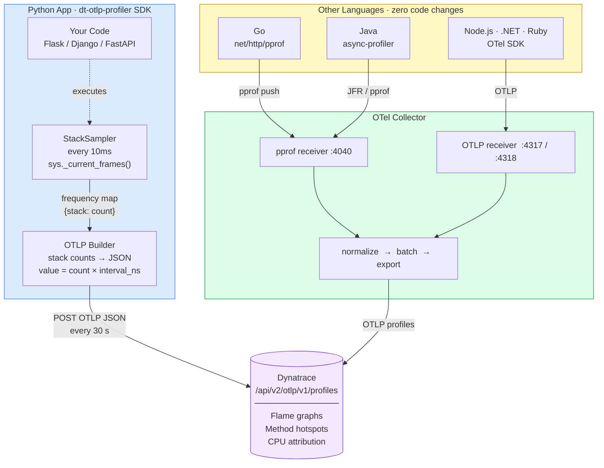
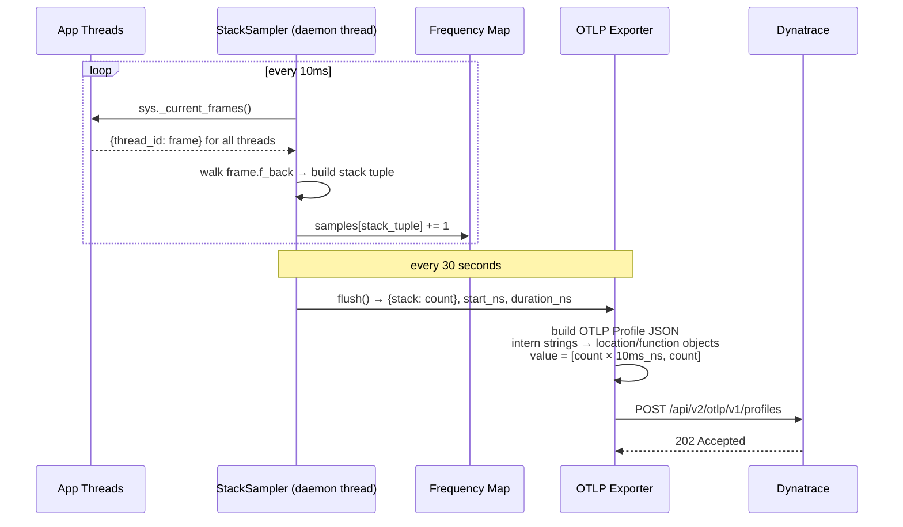
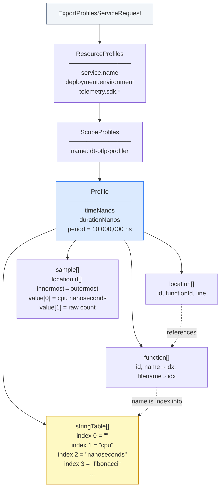
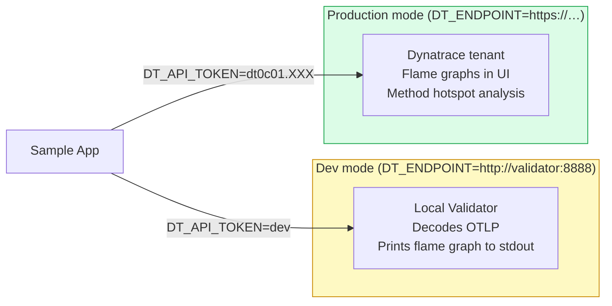

# Architecture Diagrams

## Full system

```mermaid
flowchart TB
    subgraph sdk["Python App  ·  dt-otlp-profiler SDK"]
        direction LR
        code["Your Code\nFlask / Django / FastAPI"]
        sampler["StackSampler\nevery 10ms\nsys._current_frames()"]
        builder["OTLP Builder\nstack counts → JSON\nvalue = count × interval_ns"]
        code -. "executes" .-> sampler
        sampler -- "frequency map\n{stack: count}" --> builder
    end

    subgraph other["Other Languages  ·  zero code changes"]
        go["Go\nnet/http/pprof"]
        java["Java\nasync-profiler"]
        node["Node.js · .NET · Ruby\nOTel SDK"]
    end

    subgraph collector["OTel Collector"]
        direction TB
        r_pprof["pprof receiver  :4040"]
        r_otlp["OTLP receiver  :4317 / :4318"]
        pipe["normalize  →  batch  →  export"]
        r_pprof --> pipe
        r_otlp --> pipe
    end

    DT[("Dynatrace\n/api/v2/otlp/v1/profiles\n──────────────\nFlame graphs\nMethod hotspots\nCPU attribution")]

    builder -- "POST OTLP JSON\nevery 30 s" --> DT

    go -- "pprof push" --> r_pprof
    java -- "JFR / pprof" --> r_pprof
    node -- "OTLP" --> r_otlp
    pipe -- "OTLP profiles" --> DT

    style sdk fill:#dbeafe,stroke:#3b82f6
    style other fill:#fef9c3,stroke:#ca8a04
    style collector fill:#dcfce7,stroke:#16a34a
    style DT fill:#f3e8ff,stroke:#7c3aed
```

---

## What happens inside the sampler every 10ms

```mermaid
sequenceDiagram
    participant App as App Threads
    participant Sampler as StackSampler (daemon thread)
    participant Map as Frequency Map
    participant Exporter as OTLP Exporter

    loop every 10ms
        Sampler->>App: sys._current_frames()
        App-->>Sampler: {thread_id: frame} for all threads
        Sampler->>Sampler: walk frame.f_back → build stack tuple
        Sampler->>Map: samples[stack_tuple] += 1
    end

    Note over Sampler,Exporter: every 30 seconds

    Sampler->>Exporter: flush() → {stack: count}, start_ns, duration_ns
    Exporter->>Exporter: build OTLP Profile JSON<br/>intern strings → location/function objects<br/>value = [count × 10ms_ns, count]
    Exporter->>Dynatrace: POST /api/v2/otlp/v1/profiles
    Dynatrace-->>Exporter: 202 Accepted
```

---

## OTLP payload structure

```mermaid
flowchart TD
    req["ExportProfilesServiceRequest"]
    rp["ResourceProfiles\n──────────────\nservice.name\ndeployment.environment\ntelemetry.sdk.*"]
    sp["ScopeProfiles\n──────────────\nname: dt-otlp-profiler"]
    profile["Profile\n──────────────\ntimeNanos\ndurationNanos\nperiod = 10,000,000 ns"]

    st["stringTable[]\nindex 0 = &quot;&quot;\nindex 1 = &quot;cpu&quot;\nindex 2 = &quot;nanoseconds&quot;\nindex 3 = &quot;fibonacci&quot;\n..."]
    fn["function[]\nid, name→idx, filename→idx"]
    loc["location[]\nid, functionId, line"]
    samp["sample[]\nlocationId[] innermost→outermost\nvalue[0] = cpu nanoseconds\nvalue[1] = raw count"]

    req --> rp --> sp --> profile
    profile --> st
    profile --> fn
    profile --> loc
    profile --> samp
    fn -. "name is index into" .-> st
    loc -. "references" .-> fn

    style req fill:#f1f5f9,stroke:#64748b
    style profile fill:#dbeafe,stroke:#3b82f6
    style st fill:#fef9c3,stroke:#ca8a04
```

---

## Dev mode vs production mode

```mermaid
flowchart LR
    app["Sample App"]

    subgraph dev["Dev mode  (DT_ENDPOINT=http://validator:8888)"]
        validator["Local Validator\nDecodes OTLP\nPrints flame graph to stdout"]
    end

    subgraph prod["Production mode  (DT_ENDPOINT=https://…)"]
        dt["Dynatrace tenant\nFlame graphs in UI\nMethod hotspot analysis"]
    end

    app -- "DT_API_TOKEN=dev" --> validator
    app -- "DT_API_TOKEN=dt0c01.XXX" --> dt

    style dev fill:#fef9c3,stroke:#ca8a04
    style prod fill:#dcfce7,stroke:#16a34a
```
